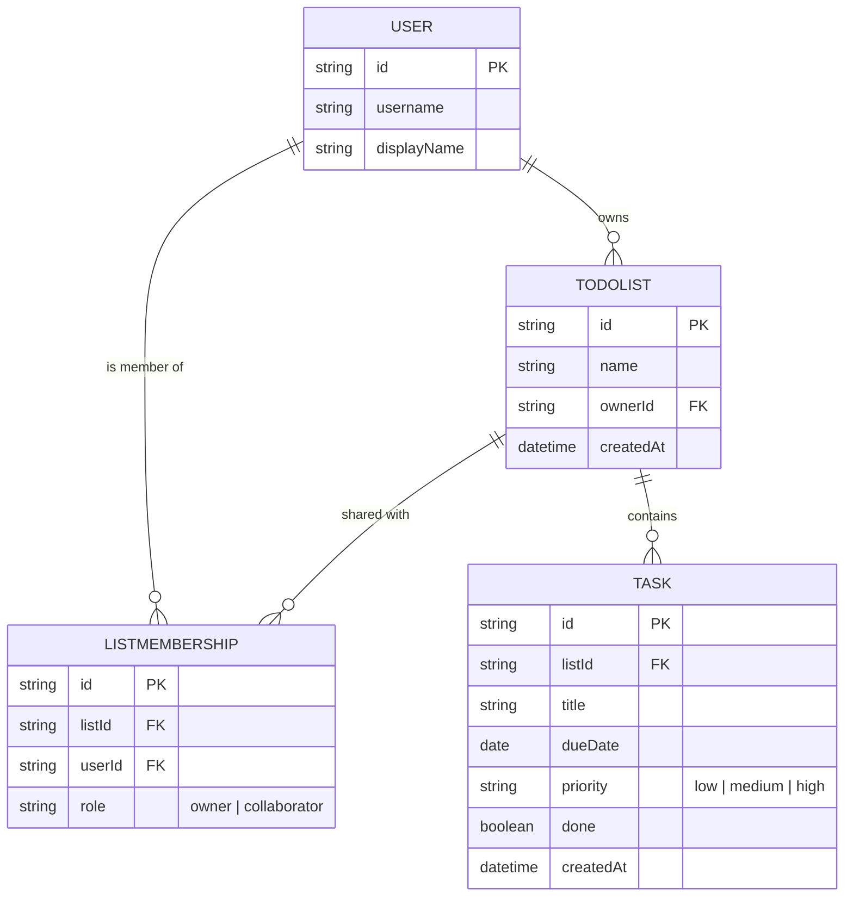

# Domain Model

The core entities: a signed-in `User` owns `TodoList`s, shares them via `ListMembership`, and each list holds `Task`s carrying a due date and priority.

- `USER` records are created/resolved from the Thunder-authenticated caller (id + username come from the identity token) rather than self-registered.
- `LISTMEMBERSHIP` carries `role` to distinguish the list owner (full management) from an invited collaborator (task edit rights only).
- `TASK.priority` is one of `low`, `medium`, `high`; `dueDate` is optional.

