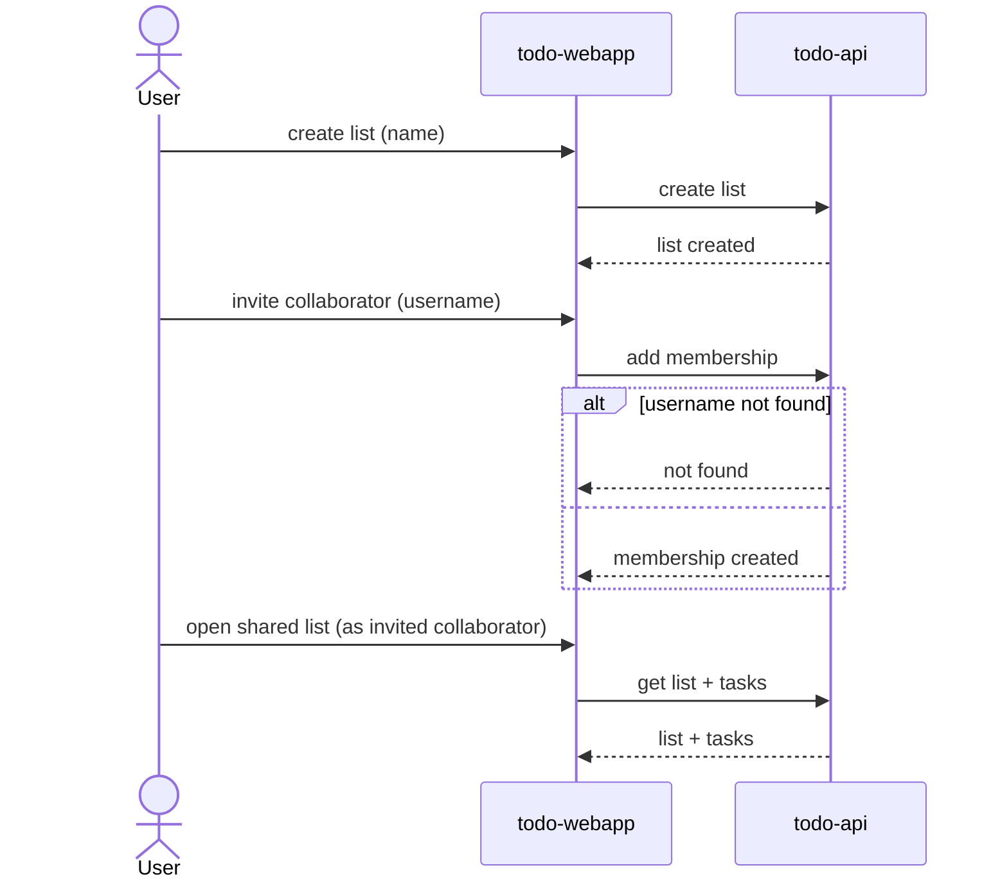

# Create and Share a List

A user creates a list, then invites another user to collaborate on it by username; the invited user then opens the shared list.

```mermaid
sequenceDiagram
    actor User
    participant todowebapp as todo-webapp
    participant todoapi as todo-api

    User->>todowebapp: create list (name)
    todowebapp->>todoapi: create list
    todoapi-->>todowebapp: list created

    User->>todowebapp: invite collaborator (username)
    todowebapp->>todoapi: add membership
    alt username not found
        todoapi-->>todowebapp: not found
    else
        todoapi-->>todowebapp: membership created
    end
    User->>todowebapp: open shared list (as invited collaborator)
    todowebapp->>todoapi: get list + tasks
    todoapi-->>todowebapp: list + tasks
```

