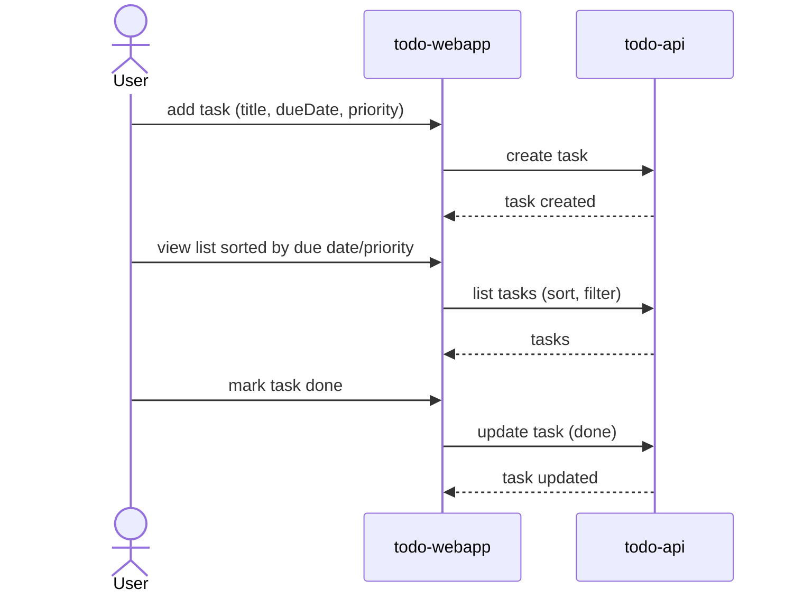

# Manage Tasks on a List

A user adds a task with a due date and priority, then updates it as work progresses, and views the list sorted by urgency.

```mermaid
sequenceDiagram
    actor User
    participant todowebapp as todo-webapp
    participant todoapi as todo-api

    User->>todowebapp: add task (title, dueDate, priority)
    todowebapp->>todoapi: create task
    todoapi-->>todowebapp: task created

    User->>todowebapp: view list sorted by due date/priority
    todowebapp->>todoapi: list tasks (sort, filter)
    todoapi-->>todowebapp: tasks

    User->>todowebapp: mark task done
    todowebapp->>todoapi: update task (done)
    todoapi-->>todowebapp: task updated
```

